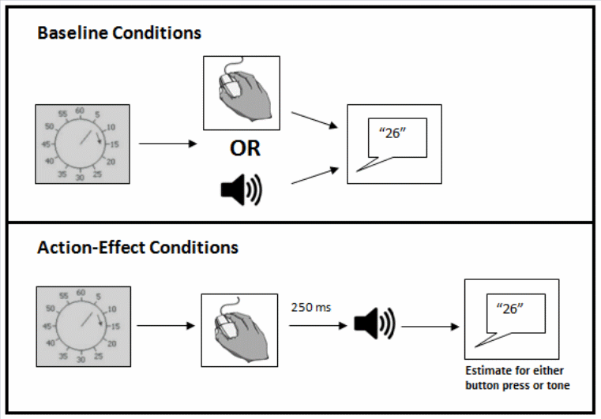
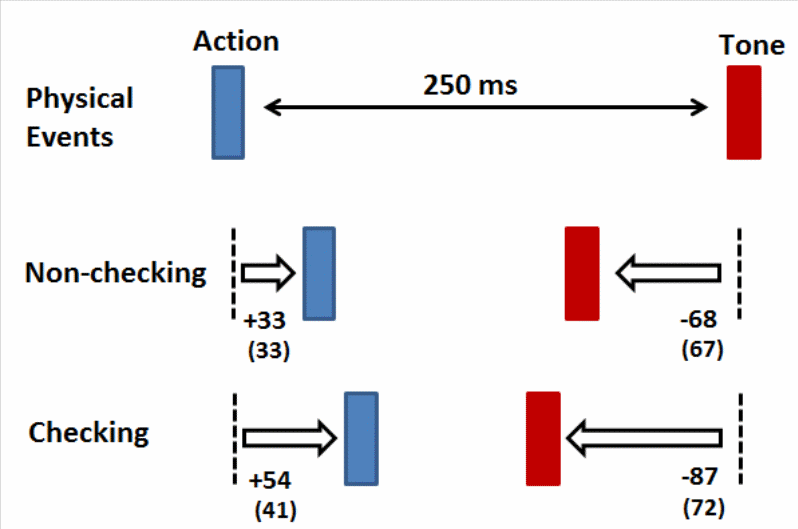

# ellen_clock

# Intentional Binding Task

## Task definition

* The procedure for this task was based on that described by Moore et al., (2010). In the task, participants sat in front of a computer screen displaying a clock face (7 cm in diameter) with a single hand. 

* The clock was marked with the conventional intervals (e.g. 5, 10, 15, etc, through to 60). 

* The hand rotated at one revolution every 2560 ms, init position = 0

* The clock hand continued to rotate for a random length of time after the tone (between 1500 ms and 2500 ms) after the button was pressed

* The [conditions] were presented in [blocks], such that the participants always estimated either the action times only, or the tone times only. There were a total of four conditions in the Intentional Binding task, and each condition was preserved in a block. The four blocks were presented in randomised order [but maybe not randomised this time], and each block consisted of 20 trials. 
    * There were four [blocks] in the task: two action–effect (agency) conditions and two baseline conditions 

* [instruct] not to only to provide responses that were multiples of five according to the numbers displayed: yield a response in {1,2,3,...,58,59,60} instead of in {0,5,10,15,...,45,50,55,60}

* [return] the mean error between estimated and actual times was calculated for each condition.

## Procedure 

### baseline with action

* The rotation of the clock hand was initiated by kb

* participant presses mac key whenever they like and this is the time stamp they are indicating when they respond. 
    * Also init listener.

* response is an estimate of what number the clock hand was pointed at at the time of the kb press, given as a time-stamped voice response

* wav file close

* repeat trial

### baseline with tone

* The rotation of the clock hand was initiated by kb

* [tone] tone (1000 Hz, 75 ms duration) occurs at [some, tbc, min.max] duration since clock init. 
    * Also init listener.

* response is an estimate of what number the clock hand was pointed at at the time of the [tone], given as a time-stamped voice response

* wav file close

* repeat trial

### action-effect tone condition

Participants were instructed not to press any button

* The rotation of the clock hand was initiated by kb

* participant presses mac key whenever they like and this is the time stamp they are indicating when they respond.

* [tone] tone (1000 Hz, 75 ms duration) occurs at [250 ms] duration since [kb press].
    * Also init listener.

* response is an estimate of what number the clock hand was pointed at at the time of the [tone], given as a time-stamped voice response

* wav file close

* repeat trial

### action-effect action condition

* The rotation of the clock hand was initiated by kb

* participant presses mac key whenever they like and this is the time stamp they are indicating when they respond.

* [tone] tone (1000 Hz, 75 ms duration) occurs at [250 ms] duration since [kb press].
    * Also init listener.

* response is an estimate of what number the clock hand was pointed at at the time of the [kb press], given as a time-stamped voice response

* wav file close

* repeat trial

